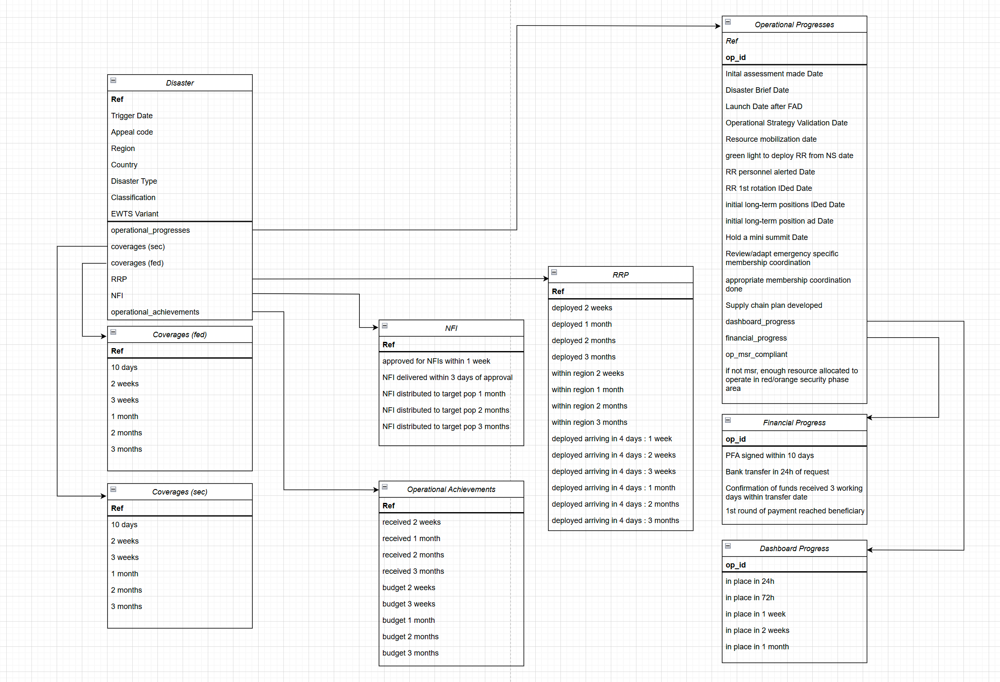
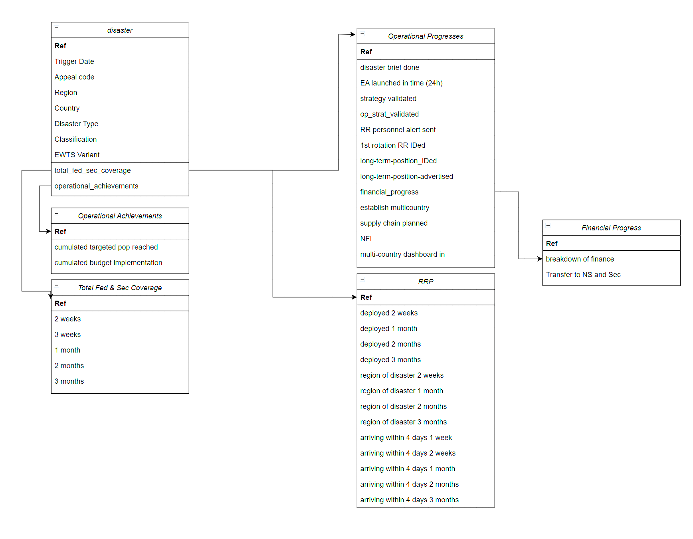

# Dashlivery
Automated Data Dashboard (Dashboard + Delivery = Dashlivery)
Deliverying a tool which would use python or javascript scripts to automate data extraction and generate a data dashboard from it.

FIGMA:
Outlayer of the Dashboard can be viewed here: [***Please Click Here***](https://www.figma.com/design/IYCVCehSJmFhVo7hyTwmpa/Untitled?node-id=0-1&t=JknX7rxZmUorBYRm-1)

Data Structure:
-- Data split for Emergency Appeals

-- Data split for DREFs

-- Data split for MCMRs

-- Data split for Protracted

GOAL:
-- Data transformation to clean and organize data for the dashboard

Questions regarding master data (for meeting) :
 -- How do we determine if an operation is active or closed (assuming we have to refer from the dataset)
 -- What does this mean "First round of payment received to the target beneficiaries four weeks after the EA launch for sudden onset (when relevant and when CVA is planned)"
 -- Is it OK to assume the EA approval date is "col M" of "EA_MD" sheet
 -- col BV and BW, shouldn't they be exclusive(???)
 -- BJ to BL -> why is first month date but other 2 percentage

