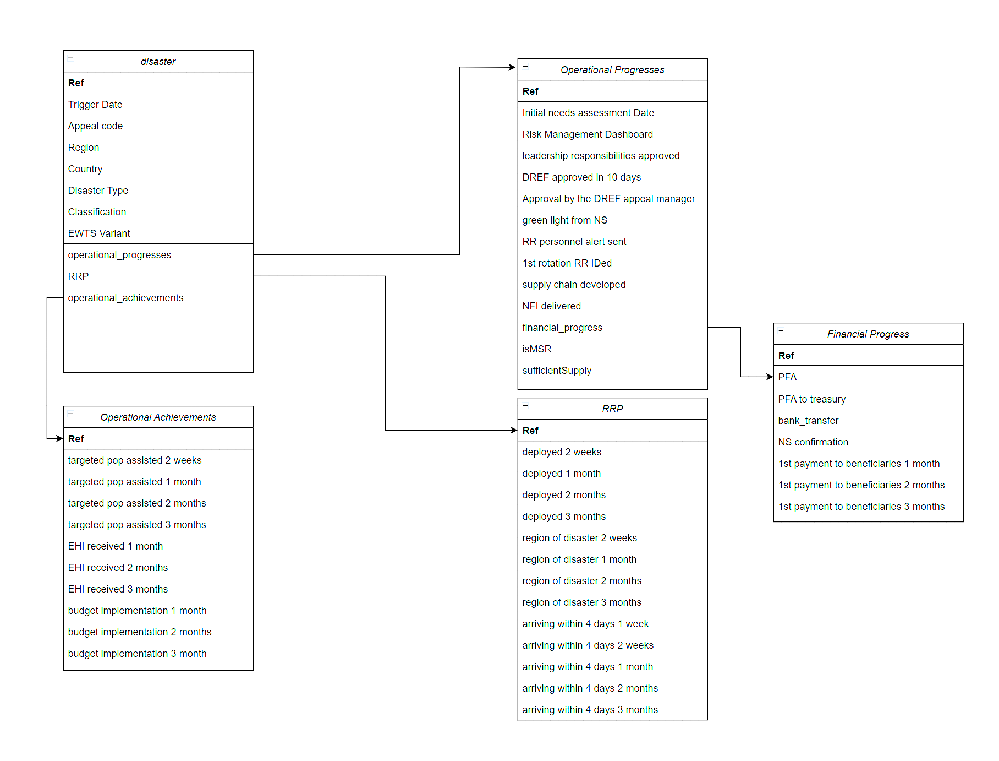

# Dashlivery
Automated Data Dashboard (Dashboard + Delivery = Dashlivery)
Deliverying a tool which would use python or javascript scripts to automate data extraction and generate a data dashboard from it.

## FIGMA:
Outlayer of the Dashboard can be viewed here: [***Please Click Here***](https://www.figma.com/design/IYCVCehSJmFhVo7hyTwmpa/Untitled?node-id=0-1&t=JknX7rxZmUorBYRm-1)

## Data Structure:
-- Data split for Emergency Appeals

-- Data split for DREFs

-- Data split for MCMRs

-- Data split for Protracted

## GOAL:
- Data transformation to clean and organize data for the dashboard
- CCA (Crisis Categorization Analysis)

 
 ## TODO:
 - Data transformation for scatter (distribution) graph
 - Optimize the code for easier maintenance in the future
 - Data Completeness (as long as it is achieved; and the deadline hasn't passed)
 - General Performance (0 for Not achieved, 1 for achieved late, 2 for achieved early, if it is doesn't  then it is 2)